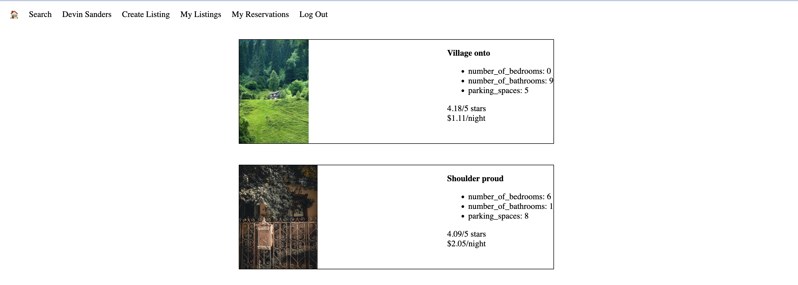

# LightBnB

LightBnB is a simple clone of AirBnB for my Lighthouse Web Development Bootcamp

## Project Purpose

** _BEWARE:_ This project was published for learning purposes. It is not intended is _not_ intended for use as production grade software 

This project was created jointly by Lighthouse labs and and published by me (Jeremy Dutton) as part of ny learnings at Lighthouse labs

## Documentation

This app possess the follow functionality:
- Displays available properties, limiting them to 10 per page
- Allows users to create a profile
- Allows users to create a property
- Allows users to view their reservations and their listings
- Allows users to filter properties by several categories including location, price, and rating. 
- Saves data in a postgres SQL database 

## Screenshots




## Dependencies

    "bcrypt": "^3.0.8",
    "cookie-session": "^1.4.0",
    "eslint": "^8.49.0",
    "express": "^4.18.2",
    "morgan": "^1.10.0",
    "nodemon": "^1.19.4",
    "pg": "^8.11.3"

## Getting Started 

- Install all dependencies using the npm install command
- Navigate to folder in terminat. Use command "npm run local"
- Got to port 3000

## Project Structure

```
.
├── db
│   ├── json
│   └── database.js
├── public
│   ├── javascript
│   │   ├── components 
│   │   │   ├── header.js
│   │   │   ├── login_form.js
│   │   │   ├── new_property_form.js
│   │   │   ├── property_listing.js
│   │   │   ├── property_listings.js
│   │   │   ├── search_form.js
│   │   │   └── signup_form.js
│   │   ├── libraries
│   │   ├── index.js
│   │   ├── network.js
│   │   └── views_manager.js
│   ├── styles
│   │   ├── main.css
│   │   └── main.css.map
│   └── index.html
├── routes
│   ├── apiRoutes.js
│   └── userRoutes.js
├── styles  
│   ├── _forms.scss
│   ├── _header.scss
│   ├── _property-listings.scss
│   └── main.scss
├── .gitignore
├── package-lock.json
├── package.json
├── README.md
└── server.js
```

* `db` contains all the database interaction code.
  * `json` is a directory that contains a bunch of dummy data in `.json` files.
  * `database.js` is responsible for all queries to the database. It doesn't currently connect to any database, all it does is return data from `.json` files.
* `public` contains all of the HTML, CSS, and client side JavaScript. 
  * `index.html` is the entry point to the application. It's the only html page because this is a single page application.
  * `javascript` contains all of the client side javascript files.
    * `index.js` starts up the application by rendering the listings.
    * `network.js` manages all ajax requests to the server.
    * `views_manager.js` manages which components appear on screen.
    * `components` contains all of the individual html components. They are all created using jQuery.
* `routes` contains the router files which are responsible for any HTTP requests to `/users/something` or `/api/something`. 
* `styles` contains all of the sass files. 
* `server.js` is the entry point to the application. This connects the routes to the database.
